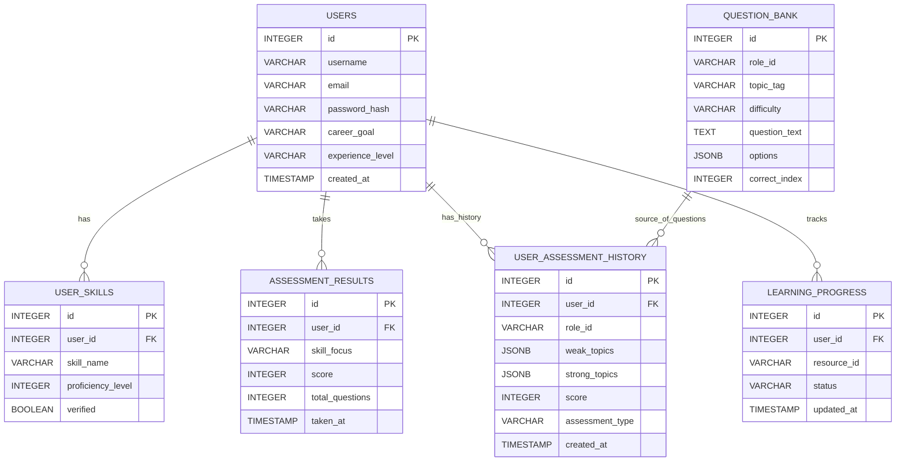

# AI Learning Path Generator

A small platform that generates personalized learning paths for career roles using a mix of a React client, an Express API server, and an AI engine (FastAPI) backed by PostgreSQL and Neo4j.

**Quick Overview**
- **Client:** React app (client/) that provides UI for role exploration, quizzes, and dashboards.
- **Server:** Node/Express API (server/) exposing auth, career, and quiz endpoints.
- **AI Engine:** Python FastAPI service (ai-engine/) that queries the knowledge graph and builds personalized learning paths.
- **Databases:** PostgreSQL (user/profile data) and Neo4j (knowledge graph). A `docker-compose.yml` is included to run both locally.

**Repository Structure**
- [client](client): React front-end (start with `npm start`).
- [server](server): Express backend (run `node index.js`).
- [ai-engine](ai-engine): FastAPI-based AI engine (run with `uvicorn main:app`).
- [data](data): JSON dumps used for seeding or reference.
- `docker-compose.yml`: launches PostgreSQL and Neo4j for local development.

**Prerequisites**
- Node.js (16+ recommended) and npm
- Python 3.10+ and pip
- Docker & Docker Compose (for databases)

Getting started (recommended order)

1) Start databases with Docker Compose

```bash
docker-compose up -d
```

This will start:
- PostgreSQL on host port `5433` -> container `5432`
- Neo4j on ports `7474` (browser) and `7687` (bolt)

2) Server (Express)

Install dependencies and run the server:

```bash
cd server
npm install
# Run directly with node (no start script in package.json)
node index.js
```

By default the server listens on port `5000` (see [server/index.js](server/index.js)).

Environment: create a `.env` in `server/` with values for:

- `DB_USER`, `DB_PASSWORD`, `DB_NAME`, `DB_HOST`, `DB_PORT`
- any other keys your environment needs (JWT secret, etc.)

3) AI Engine (FastAPI)

Install Python deps and run the AI engine:

```bash
cd ai-engine
pip install -r requirements.txt
# Run with reload for development
uvicorn main:app --reload --host 0.0.0.0 --port 8000
```

Health and endpoints are defined in `ai-engine/main.py` (FastAPI). The engine expects to connect to Neo4j and PostgreSQL — configure via environment variables or the `db_connector.py` file.

4) Client (React)

Install and run the client UI:

```bash
cd client
npm install
npm start
```

This launches the React dev server (usually on port `3000`). The client calls the Express server endpoints to authenticate, fetch roles, and submit quiz data.

Seeding the databases

- Neo4j graph seeding: see `ai-engine/seed_graph.py` and `ai-engine/seed_questions_db.py` for helper scripts to populate the knowledge graph and question bank.
- PostgreSQL schema and sample data: `server/init_db.sql` (and related `fix_columns.sql`, `repair_db.sql`, `update_schema.sql`).

Data sources

- `data/career_data.json` — career definitions used by the system.
- `data/question_bank_dump.json` — question bank dump used by the quiz engine.

Notes & tips

- If you run the server and the AI engine locally, make sure environment DB connection settings point to the Docker Compose PostgreSQL (`host: localhost`, `port: 5433`) and Neo4j bolt port `7687` with the credentials set in `docker-compose.yml`.
- The Express `package.json` currently does not define a `start` script; run `node index.js` or add a `start` script if you prefer `npm start`.
- The AI engine is designed to run with `uvicorn` and exposes endpoints in `ai-engine/main.py`.

Where to look next

- Frontend: [client/src](client/src) — React pages and components.
- API routes: [server/routes](server/routes) — auth, career, quiz handlers.
- AI engine logic and DB connector: [ai-engine/db_connector.py](ai-engine/db_connector.py) and [ai-engine/main.py](ai-engine/main.py).

**Entity-Relationship Diagram**

Below is a derived ER diagram showing the primary Postgres entities and their relationships as inferred from `server/init_db.sql` and the API route logic.

Mermaid diagram (rendered on platforms that support Mermaid):



Plaintext summary (quick reference):

- `users` (PK: `id`) — central user profile and auth record.
- `user_skills` (FK: `user_id` -> `users.id`) — self-reported or assessed skills.
- `assessment_results` (FK: `user_id` -> `users.id`) — simple quiz/assessment results.
- `user_assessment_history` (FK: `user_id` -> `users.id`) — granular history with `weak_topics`/`strong_topics` JSON.
- `question_bank` — role- and topic-tagged questions used by the quiz service.
- `learning_progress` (FK: `user_id` -> `users.id`) — cross-reference to `resource_id` (resources live in Neo4j/JSON).

Notes & inconsistencies observed
- The code inserts `score` and `assessment_type` into `user_assessment_history`, but the original `init_db.sql` table definition does not include `score` or `assessment_type` columns; you may want to alter that table to add them:

```sql
ALTER TABLE user_assessment_history ADD COLUMN IF NOT EXISTS score INTEGER;
ALTER TABLE user_assessment_history ADD COLUMN IF NOT EXISTS assessment_type VARCHAR(50);
```

- `learning_progress.resource_id` references resource IDs stored in Neo4j (string), not a Postgres FK.
- The `question_bank.options` column is stored as `JSONB` (array of options) and `correct_index` is an integer index into that array.

Want me to?
- Add a `start` script to `server/package.json` and `npm run` convenience scripts.
- Update `client/README.md` with app-specific instructions and screenshots.
- Create `.env.example` files for `server/` and `ai-engine/`.


